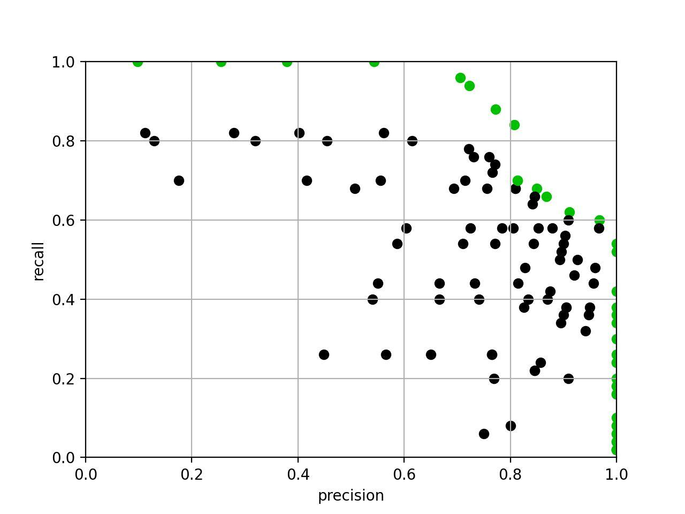

# Machine-Learning
*Inspired by a real-life story!*

sneakinaround is doing a machine-learning project. After gruelling hours of tuning hyper-parameters, he has managed to obtain a beautiful graph illustrating the trade-offs between precision and recall. However, he realised that his current graph is terribly messy and unsuited for presentations. Fortunately, some points are obviously useless. If a set of hyper-parameters give a strictly worse precision and recall, then it can definitely be thrown away. More formally, for a set of hyper-parameters that gives precision and recall (p, r), it will be thrown away if and only if there exist a set of hyper-parameters that gives precision and recall (p', r') such that p <= p' and r <= r'. If two set of hyper-parameters give the same precision and recall values, the set with the smaller index will be thrown away.



##### Input Specification
The first line will contain a single integer, N.
The 2+i-th (0 <= i < N) line of input will contain two integers, p_i and r_i.

##### Output Specification
The first must contain a single integer, M, the number of sets remaining.
The next M lines must contain the i's the remaining sets in ascending order.

##### Subtasks
* 1 <= N <= 200000
* 1 <= N <= 5000000
For all subtasks, p_i, r_i are integers between 0 and 5000000 inclusive (sneakinaround has scaled all the values for you).

##### Sample Input
```
4
0 0
0 2
1 0
1 1
```

##### Sample Output
```
2
1
3
```
