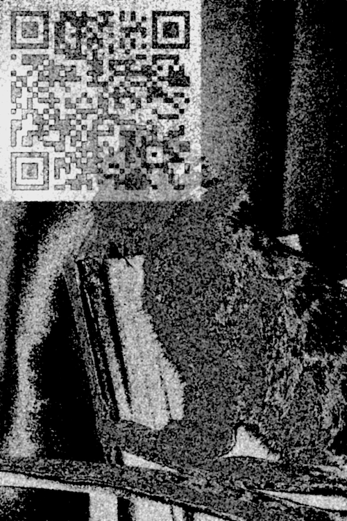

# Corrupted solution

Upon inspection of the corrupted file, you find that it likely simply has missing headers. Based off the file structure and the challenge description mentioning multiple images, you deduce that it's possibly a ZIP file.

You add the zip file headers `PK` using a hex editor and unzip it.

You find many photos, but no sign of the flag. The challenge description hints us towards the cat picture.

Upon closer look, you notice a QR code at the top left corner. Through trial and error, you filter the image by the 3 least significant bits, and a further increase in contrast, to be able to comfortably see the QR code.

You may find that even though the QR code can be made to be pretty obvious, most scanners are not able to pick up the QR code due to the noise. In that case, you can easily trace out the code to get the following:

Now, you can scan it and get the following base64 string:

`Y3RmeytoNG5rNV9mMHJfaDNscDFuNl90MF9mMXghfQ==`

Decode it and you get the flag:

`ctf{+h4nk5_f0r_h3lp1n6_t0_f1x!}`
