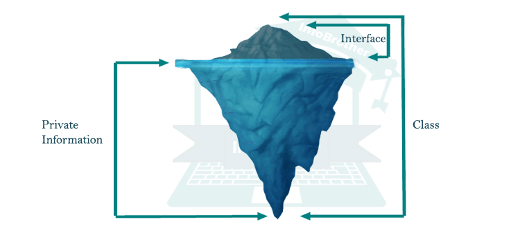

# OOP

Object Oriented Programming is an important concept to learn in programming.

_Information Hiding_ is one of the most important principles of OOP, inspired from real life - which says that all information should not be accessible to all persons. _Private information_ should only be accessible to its owner.

In OOP, we usually have classes. A purpose of classes is to allow for information hiding in the form of abstraction and encapsulation, exposed through some form of interface which we have control over. Here's a graphic:

Info and image source: infobrother.com

Flag format: `ctf{...}`
