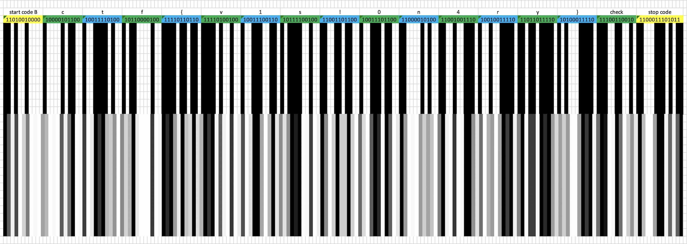

# Reddit Post unintended solution

Launch a barcode scanner on your phone and shake it randomly, it may very rarely work.

# Reddit Post intended solution

You can manually figure out the original barcode by eye, using the grayscale lines as hints for how the original barcode was interpolated for thumbnail generation. A spreadsheet editor like Excel may be useful for this task.

Looking up on Wikipedia, you find [Code 128](https://en.wikipedia.org/wiki/Code_128) to be one of the most promising formats for this, as it can encode all ASCII characters (and thus the entire flag can be encoded in it).

Noting that we can get the start and stop codes correctly, we can then decode the rest.



Flag: ```ctf{v1s!0n4ry}```
