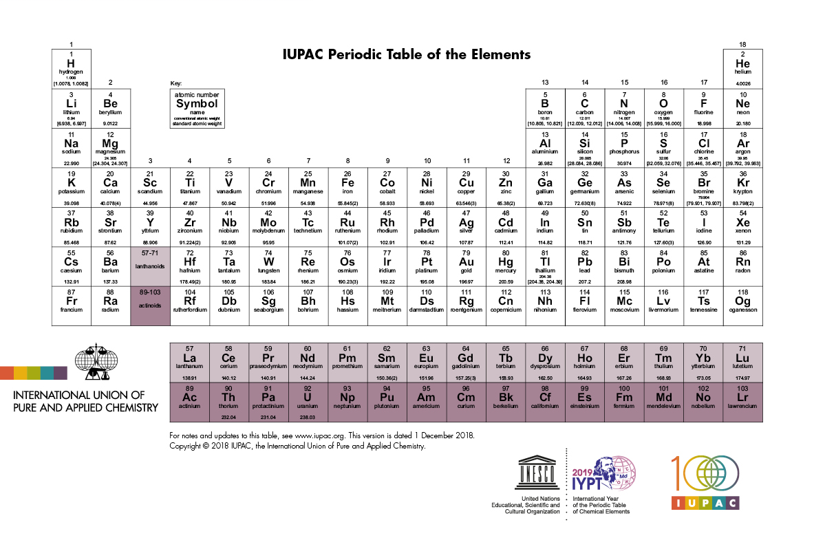

# Table

Walking into the mysterious lab, you are greeted by a bizarre sight: balloons everywhere and a laptop, bunch of metal samples in oil and a random slab of pumice stone on the table...what's going on? Curious, you walked closer to find a suspicious image on the screen.

...wait what?!

(remark: it is possible to solve this challenge without knowing Chemistry)
